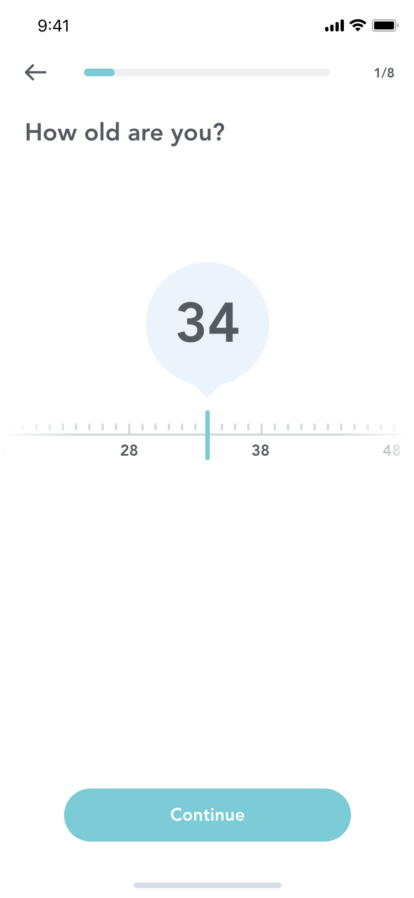

# Notes

## Requirements

- Header

  - Back Button
  - prograss bar
  - step indicator

- Lable Text

- Age Select

  - sliding ruler
  - bubble tooltip

- Button

## Options

- min
- max
- value

## Behaviors

- [x] User should be able to scroll the ruler and bubbtle tooltip should display the selected number

- [x] When press the continue button, the value should be emit

- [x] using a textinput for number, so user could change input it directly and it would be more accessible.

- [ ] When scroll the ruler, it could have some taptic and sound feedbacks (can't do it in react-native)

## TL;DR

IMO, this design is not suitable for the current user case. It has some drawbacks

- Not a11y friendly

- indirectly when comparing to TextInput

This design might be more useful in

- To input a numeric value that belongs to an unlimited range or a particularly large one.
- To input measurable values like masses or lenghts.
